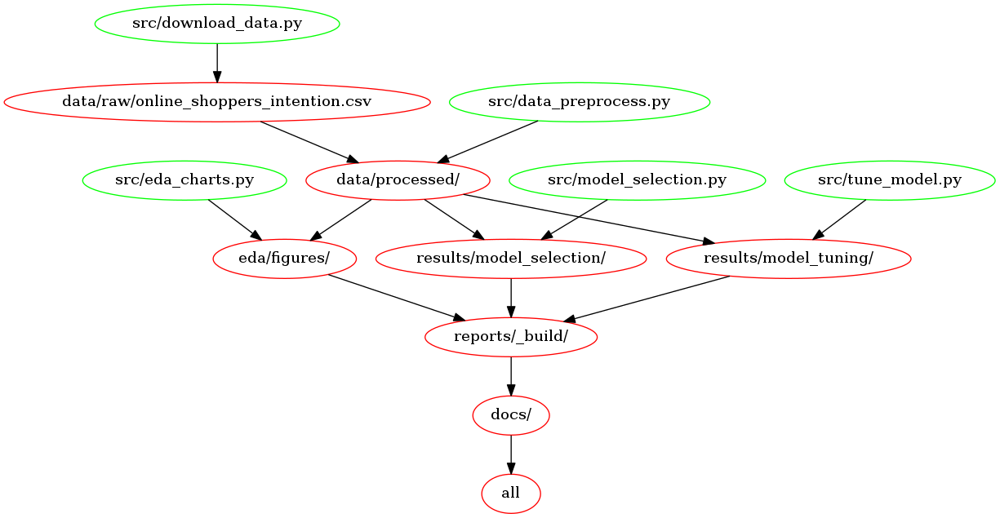

# Online Shoppers Purchasing Intention

Contributors: Nico Van den Hooff, Ting Zhe (TZ) Yan, Arijeet Chatterjee

## Summary

This repository contains our work for our project focused on applying machine learning classification models to e-commerce data. Specifically, we built a Random Forest classification model in order to determine if a website visitor will complete a purchase or not.

## Research question

The research question that we attempted to answer with our analysis is stated as follows:
> Given clickstream and session data of a user who visits an e-commerce website, can we predict whether or not that visitor will make a purchase?

Nowadays, it is common for companies to sell their products online, with little to no physical presence such as a traditional brick and mortar store. Answering this question is critical for these types of companies in order to ensure that they are able to remain profitable. This information can be used to nudge a potential customer in real-time to complete an online purchase, increasing overall purchase conversion rates. Examples of nudges include highlighting popular products through social proof, and exit intent overlay on webpages.

## Data set

The dataset used in our analysis was obtained from the [UC Irvine Machine Learning Repository](https://archive-beta.ics.uci.edu/), a popular website with hundreds of datasets available for analysis. The creators of the dataset are C. Sakar and Yomi Kastro, and the original dataset can be obtained at this [link](https://archive-beta.ics.uci.edu/ml/datasets/online+shoppers+purchasing+intention+dataset).

Each row in the dataset contains a feature vector that contains data corresponding to a visit "session" (period of time spent) of a user on an e-commerce website. The dataset was specifically formed so that each session would belong to a unique user over a 1-year period. The total number of sessions in the dataset is 12,330.

Examples of features included in the dataset are:

- Duration (time) spent on Administrative, Informational, or Product related sections of the website.
- Data from Google Analytics such as bounce rate, exit rate, and page value.
- What month the session took place it, and whether or not the day of the session falls on a weekend.
- The operating system and browser used by the website visitor.

The target feature and class label in the dataset is called `Revenue` and contains either a `True` or `False` value, which correspond to whether or not the user made a purchase on the website during their visit, respectively. It is worth noting that the dataset is unbalanced, as 85% of the sessions contain a `False` class label, with the remaining 15% containing a `True` label.

Our analysis includes a detailed table that describes each feature in detail.

## Analysis

We have published a copy of our final analysis in the form of a [Jupyter Book](https://ubc-mds.github.io/online-shoppers-purchasing-intention/intro.html)

## Usage

To replicate our analysis, you will first need to clone our repo.  You can do so with the following command line (terminal) commands.

```bash
# clone our repo
git clone https://github.com/UBC-MDS/online-shoppers-purchasing-intention.git

# change working directory to our repos root directory
cd online-shoppers-purchasing-intention
```

You can automatically replicate our analysis by using one of the following two methods:

### Method 1: Using Docker

First, install [Docker](https://www.docker.com/get-started).

Then, run the following command to reset our repository to a clean state, with no intermediate or results files:

```bash
docker run --rm -v /$(pwd):/home/analysis nicovandenhooff/online-shoppers-purchasing-intention:latest make -C /home/analysis clean
```

Finally, run the following command to replicate our analysis (note: this will take some time):

```bash
docker run --rm -v /$(pwd):/home/analysis nicovandenhooff/online-shoppers-purchasing-intention:latest make -C /home/analysis all
```

### Method 2: Without using Docker

First, create and activate the required virtual environment with conda at the command line as follows:

```bash
conda env create -f environment.yaml
conda activate project_env
```

Then, run the following command at the command line (terminal) to reset our repository to a clean state, with no intermediate or results files:

```bash
make clean
```

Finally, run the following command to replicate our analysis (note: this will take some time):

```bash
make all
```

## Makefile dependency graph



## Dependencies

Python 3.9 and Python packages

- altair=4.1.0
- numpy=1.21.2
- pandas=1.3.3
- scikit-learn=1.0
- scipy=1.7.1
- pip>=20
- ipykernel=6.5.0
- docopt=0.6.2
- xgboost=1.5.0
- altair_saver
- altair-data-server==0.4.1
- jupyter-book==0.12.1

## License

The source code for the site is licensed under the MIT license, which you can find [here](https://github.com/UBC-MDS/online-shoppers-purchasing-intention/blob/main/LICENSE).

## References

Sakar, C., and Kasto, Yomi. 2018. “UCI Machine Learning Repository.” University of California, Irvine, School of Information; Computer Sciences. [https://archive-beta.ics.uci.edu/](https://archive-beta.ics.uci.edu/).
