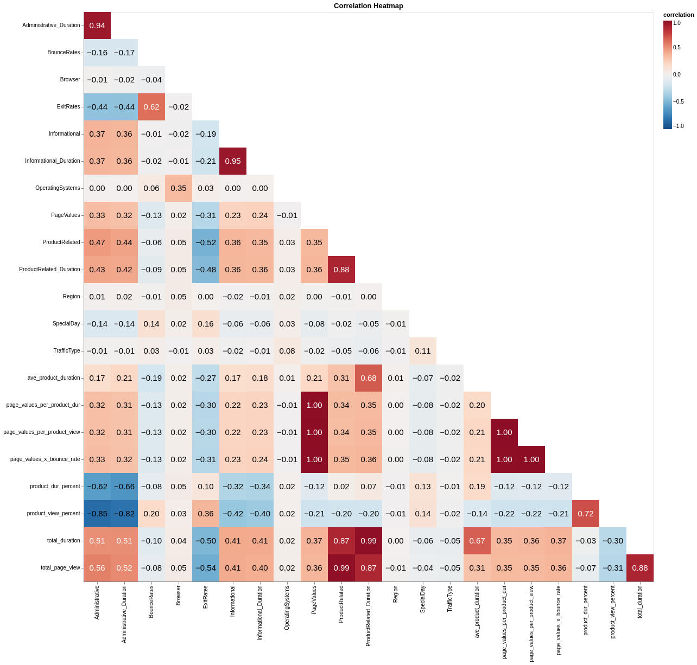

# Data Analysis

The data consists of numeric and categorical features. Amongst these features, "BounceRates", "ExitRates" and "PageValues" features represent the metrics measured by "Google Analytics" for each session on the e-commerce site. The key observations from our data analysis are:

1. Our dataset is imbalanced, where only 15% of sessions ended in a purchase

2. `PageValues` may be one of the most important feature in predicting a purchase conversion

3. Many numeric features are right-skewed

## Imbalanced Dataset

This dataset is imbalanced, where only 15% of sessions ended in a purchase. While 15% is not extremely imbalanced, we can still explore methods or algorithms that are better at dealing with an imbalanced dataset.

## Importance of Page Values

`PageValues` is defined as the average page value of the pages visited by the user. In an e-commerce context, values are normally assigned to important pages such as checkout pages, or pages preceding the checkout process. As seen from the figure above, having a `PageValues` of above 5 increases the likelihood of purchase conversion. Hence, this `PageValues` feature provides a strong signal on whether the user will make a purchase or not.

## Correlation plot of the dataset

Based on the above insight on `PageValues`, we looked at the correlation between numeric features to find whether other features are strongly correlated with `PageValues`. 

We see that higher pageview and longer browsing duration have a positive correlation with `PageValues`. This is intuitive, as higher pageview and longer browsing duration indicate high engagement from the user. For example, if a user already had an item in mind, they might spend more time on an e-commerce website to compare prices reviews of similar products. A highly engaged user will be more likely to purchase than a passive user.

Another feature of interest is `ExitRates`, which is negatively correlated with `PageValues`. `ExitRates` is defined as the average exit rate of the pages visited by the user. `ExitRates` is also positively correlated with `BounceRates`. This finding fits well in our 'engaged user' hypothesis: sessions with high `ExitRates` or `BounceRates` indicate a less engaged user, resulting in fewer purchase conversions.

## Right-skewed feature distribution

Finally, we also noted that many numeric features are right-skewed with long tails. This is common in e-commerce settings, whereby some users have extremely high usage statistics. We can experiment with the removal of outliers, or feature transformation such as Box-Cox, and see whether it will help in model performance.

