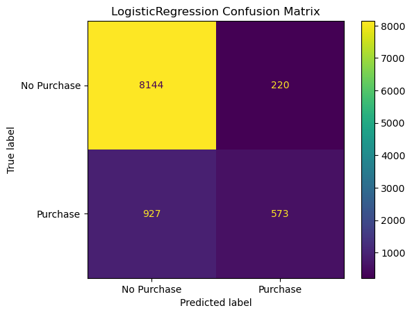
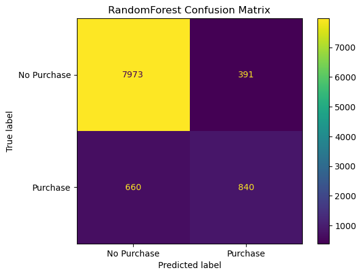

# Model selection

## Metrics

In determining the metric we use for our model, we need to first consider the context of Type I and Type II errors for our problem:

- A type I (false positive) error would be predicting that a customer will make a purchase, when they in fact do not.
- A type II (false negative) error would be predicting that a customer will not make a purchase, when in fact they do.

In determining the metric we use for our model, we need to consider the business objective of the e-commerce company. We assume that the company will have the following objectives: 1) maximize revenue by increasing purchase conversion rate, and 2) minimize disruption to customer experience from targeted nudges.

Based on this, we can use precision, recall, and average precision. To be more specific, we want to maximize recall, while keeping a minimum threshold of 60% precision (threshold based on business requirement and tolerance). Average precision will be a secondary metric to monitor, since we are interested in both precision and recall.

## Base model

Our based model will be the `DummyClassifier` model from `sklearn` with the default parameters.  From the `sklearn` [documentation](https://scikit-learn.org/stable/modules/generated/sklearn.dummy.DummyClassifier.html), the default `strategy` parameter is `prior` which always predicts the class that maximizes the class prior (like “most_frequent”) and predict_proba returns the class prior.

## Additional models tested

In performing model selection, we will fit the following models to our training data, and use cross validation to assess which model to select for further hyperparameter tuning:

- Logistic Regression
- Support Vector Machine w/ RBF kernl
- Random Forest Classifier
- XGBoost Classifier

## Cross validation results

We performed 5 fold cross validation for the above models on our training data and observed the following metrics.  Please note that the following scores are the mean values over the 5 folds of cross validation:

<table id="T_2348e_">
  <thead>
    <tr>
      <th class="blank level0" >&nbsp;</th>
      <th class="col_heading level0 col0" >DummyClassifier</th>
      <th class="col_heading level0 col1" >LogisticRegression</th>
      <th class="col_heading level0 col2" >SVC</th>
      <th class="col_heading level0 col3" >RandomForest</th>
      <th class="col_heading level0 col4" >XGBoost</th>
    </tr>
  </thead>
  <tbody>
    <tr>
      <th id="T_2348e_level0_row0" class="row_heading level0 row0" >fit_time</th>
      <td id="T_2348e_row0_col0" class="data row0 col0" >0.00 (+/- 0.00)</td>
      <td id="T_2348e_row0_col1" class="data row0 col1" >0.17 (+/- 0.01)</td>
      <td id="T_2348e_row0_col2" class="data row0 col2" >1.19 (+/- 0.10)</td>
      <td id="T_2348e_row0_col3" class="data row0 col3" >0.73 (+/- 0.04)</td>
      <td id="T_2348e_row0_col4" class="data row0 col4" >0.63 (+/- 0.02)</td>
    </tr>
    <tr>
      <th id="T_2348e_level0_row1" class="row_heading level0 row1" >score_time</th>
      <td id="T_2348e_row1_col0" class="data row1 col0" >0.00 (+/- 0.00)</td>
      <td id="T_2348e_row1_col1" class="data row1 col1" >0.01 (+/- 0.00)</td>
      <td id="T_2348e_row1_col2" class="data row1 col2" >0.72 (+/- 0.07)</td>
      <td id="T_2348e_row1_col3" class="data row1 col3" >0.03 (+/- 0.00)</td>
      <td id="T_2348e_row1_col4" class="data row1 col4" >0.01 (+/- 0.00)</td>
    </tr>
    <tr>
      <th id="T_2348e_level0_row2" class="row_heading level0 row2" >test_accuracy</th>
      <td id="T_2348e_row2_col0" class="data row2 col0" >0.85 (+/- 0.00)</td>
      <td id="T_2348e_row2_col1" class="data row2 col1" >0.88 (+/- 0.02)</td>
      <td id="T_2348e_row2_col2" class="data row2 col2" >0.89 (+/- 0.03)</td>
      <td id="T_2348e_row2_col3" class="data row2 col3" >0.89 (+/- 0.03)</td>
      <td id="T_2348e_row2_col4" class="data row2 col4" >0.88 (+/- 0.04)</td>
    </tr>
    <tr>
      <th id="T_2348e_level0_row3" class="row_heading level0 row3" >train_accuracy</th>
      <td id="T_2348e_row3_col0" class="data row3 col0" >0.85 (+/- 0.00)</td>
      <td id="T_2348e_row3_col1" class="data row3 col1" >0.89 (+/- 0.01)</td>
      <td id="T_2348e_row3_col2" class="data row3 col2" >0.91 (+/- 0.01)</td>
      <td id="T_2348e_row3_col3" class="data row3 col3" >1.00 (+/- 0.00)</td>
      <td id="T_2348e_row3_col4" class="data row3 col4" >0.99 (+/- 0.00)</td>
    </tr>
    <tr>
      <th id="T_2348e_level0_row4" class="row_heading level0 row4" >test_precision</th>
      <td id="T_2348e_row4_col0" class="data row4 col0" >0.00 (+/- 0.00)</td>
      <td id="T_2348e_row4_col1" class="data row4 col1" >0.73 (+/- 0.15)</td>
      <td id="T_2348e_row4_col2" class="data row4 col2" >0.71 (+/- 0.13)</td>
      <td id="T_2348e_row4_col3" class="data row4 col3" >0.69 (+/- 0.13)</td>
      <td id="T_2348e_row4_col4" class="data row4 col4" >0.65 (+/- 0.16)</td>
    </tr>
    <tr>
      <th id="T_2348e_level0_row5" class="row_heading level0 row5" >train_precision</th>
      <td id="T_2348e_row5_col0" class="data row5 col0" >0.00 (+/- 0.00)</td>
      <td id="T_2348e_row5_col1" class="data row5 col1" >0.77 (+/- 0.02)</td>
      <td id="T_2348e_row5_col2" class="data row5 col2" >0.78 (+/- 0.01)</td>
      <td id="T_2348e_row5_col3" class="data row5 col3" >1.00 (+/- 0.00)</td>
      <td id="T_2348e_row5_col4" class="data row5 col4" >1.00 (+/- 0.00)</td>
    </tr>
    <tr>
      <th id="T_2348e_level0_row6" class="row_heading level0 row6" >test_recall</th>
      <td id="T_2348e_row6_col0" class="data row6 col0" >0.00 (+/- 0.00)</td>
      <td id="T_2348e_row6_col1" class="data row6 col1" >0.38 (+/- 0.08)</td>
      <td id="T_2348e_row6_col2" class="data row6 col2" >0.48 (+/- 0.11)</td>
      <td id="T_2348e_row6_col3" class="data row6 col3" >0.56 (+/- 0.13)</td>
      <td id="T_2348e_row6_col4" class="data row6 col4" >0.56 (+/- 0.12)</td>
    </tr>
    <tr>
      <th id="T_2348e_level0_row7" class="row_heading level0 row7" >train_recall</th>
      <td id="T_2348e_row7_col0" class="data row7 col0" >0.00 (+/- 0.00)</td>
      <td id="T_2348e_row7_col1" class="data row7 col1" >0.41 (+/- 0.04)</td>
      <td id="T_2348e_row7_col2" class="data row7 col2" >0.55 (+/- 0.07)</td>
      <td id="T_2348e_row7_col3" class="data row7 col3" >1.00 (+/- 0.00)</td>
      <td id="T_2348e_row7_col4" class="data row7 col4" >0.94 (+/- 0.02)</td>
    </tr>
    <tr>
      <th id="T_2348e_level0_row8" class="row_heading level0 row8" >test_f1</th>
      <td id="T_2348e_row8_col0" class="data row8 col0" >0.00 (+/- 0.00)</td>
      <td id="T_2348e_row8_col1" class="data row8 col1" >0.50 (+/- 0.10)</td>
      <td id="T_2348e_row8_col2" class="data row8 col2" >0.57 (+/- 0.12)</td>
      <td id="T_2348e_row8_col3" class="data row8 col3" >0.62 (+/- 0.13)</td>
      <td id="T_2348e_row8_col4" class="data row8 col4" >0.60 (+/- 0.13)</td>
    </tr>
    <tr>
      <th id="T_2348e_level0_row9" class="row_heading level0 row9" >train_f1</th>
      <td id="T_2348e_row9_col0" class="data row9 col0" >0.00 (+/- 0.00)</td>
      <td id="T_2348e_row9_col1" class="data row9 col1" >0.53 (+/- 0.04)</td>
      <td id="T_2348e_row9_col2" class="data row9 col2" >0.64 (+/- 0.05)</td>
      <td id="T_2348e_row9_col3" class="data row9 col3" >1.00 (+/- 0.00)</td>
      <td id="T_2348e_row9_col4" class="data row9 col4" >0.97 (+/- 0.01)</td>
    </tr>
  </tbody>
</table>

From the above we can see that:

- The logistic regression model had the best precision scores on the validation tests during cross validation.  However, the recall scores of this model were quite poor.
- The support vector machine had similar precision scores to the logistic regression model, and slightly better recall scores.
- The random forest model and XGBoost models both severely overfit the training set, which can be seen by perfrect accuracy and precision scores.  However, the recall scores on the test set of these models are still higher than the logistic regression and support vector machine models.
- The F1 scores of the models are consistent with the analysis above.

## Preliminary confusion matrices

In addition we used sklearns `cross_val_predict` to generate the following preliminary confusion matrices:

The dummy classifier confusion matrix simply serves as a baseline.

The logistic regression model is outputing 220 false positives, and 927 false negatives.

The support vector machine is outputing 286 false positives, and 777 false negatives.

The random forest is outputing 388 false positives, and 666 false negatives.

The XGBoost model is outputing 478 false positives, and 657 false negatives.

## Model selection

We note that the above results were obtained with no hyperparameter tuning.  Based on these results alone, we can see that the random forest appears to be a promising model for our problem.  We will therefore select this model to tune further.  Random forests tend to be a great model for classification problems as they inject randomness into a probelm in the form of bagging and random features {cite}`breiman2001random`.